# Working-With-Docker-Containers
```
This project guides you into the world of containerization through hands-on exercises with Docker. Explore the creation, management, and deployment of containers as portable, scalable units of runtime, gaining practical skills to build efficient and consistent application environments.
```
## Running Containers
```
To run a container, you use the docker run command followed by the name of the image you want to use. This command tells Docker to create a new container from the specified image and start it.

For example, earlier we downloaded the Ubuntu image from Docker Hub. Now, by running docker run ubuntu, Docker will launch a new container using that image as its base. Inside this container, you get a lightweight, isolated Ubuntu environment where you can execute commands and run applications without affecting your host system.

This is the key idea of containers: they allow you to run applications in a separate, consistent environment built from an image.
```
```
docker run ubuntu
```
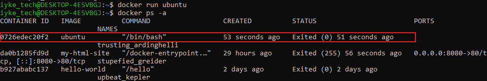
```
The output shown above indicates that the container has been successfully created but is currently in a stopped state, meaning it is not running. To make the container active and start it, you need to use the docker start command followed by the container ID or name.
```
```
docker start CONTAINER_ID
```
## Launching Containers with Different Options
```
Docker lets you customize how containers run by using different options with the docker run command. For example, you can:
```
- Set environment variables to pass configuration values into the container.
- Map ports so the container can be accessed from your host machine.
- Mount volumes to share files and data between your host and the container.
```
```
Here’s a basic example that shows how to run a container with a specific environment variable:
```
docker run -e "MY_VARIABLE=my-value"
```
## Container Lifecycle
```
Containers go through a lifecycle, which means they can be created, started, stopped, and even restarted as needed. Once you create a container from an image, you don’t have to create it again — you can start and stop it many times, depending on your needs.
```
```
In this section, we’ll look at how to:
```
`Start, Stop, and Restart` containers using `Docker commands`.

- To start a stopped container:
```
docker start container_name
```
- To stop a running container:
```
docker stop container_name
```
- To restart a container:
```
docker restart container name
```
## Removing Containers

When a container is no longer needed, you can remove it from your system using the docker `rm command`, followed by either the container’s ID or its name.
```
For example:
```
```
docker rm container_name
```
```
This command permanently deletes the container, freeing up resources. However, it’s important to note that removing a container does not delete the image it was created from. The image will still remain on your system and can be used to create new containers later.
```
## Hands on Project for clearer and better understanding
```
In this project, I applied the fundamental concepts of Docker containers in a practical setting to gain hands-on experience. By working directly with container creation, execution, lifecycle management, and removal, I reinforced my understanding of how Docker images and containers function in real-world scenarios.
```
## Confirm Docker is Running
 ```
 Here, I executed a basic Docker command to verify that the Docker service is running correctly on my system. This simple check confirms that Docker is properly installed, the daemon is active, and the environment is ready for creating and managing containers.
```
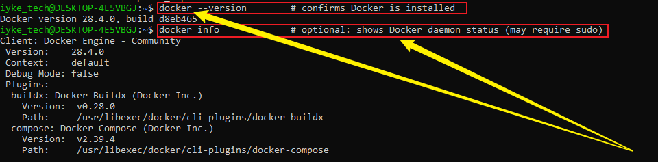

## Ubuntu image
```
Since the official Ubuntu image has already been downloaded to my local system, I can now proceed to create and start a container using this image. This step will launch an isolated Ubuntu environment, allowing me to run commands and interact with the container without affecting the host system.
```
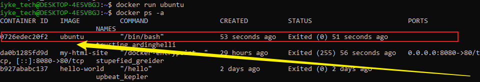

## Start a container (detached) and keep it running

In this step, I created and started a container from the Ubuntu image, giving it the name `sidehustle` for easy reference. I used the command `tail -f /dev/null` to keep the container running in the background, ensuring it stays active and ready for further commands without exiting immediately.

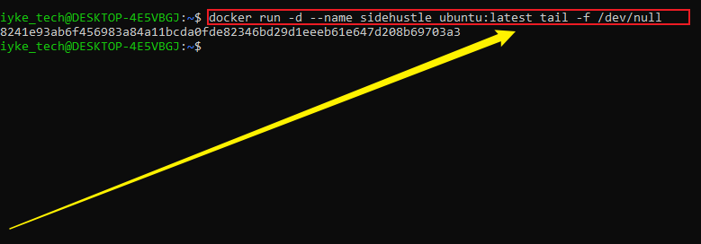

## Run a simple command inside the running container

In this step, I executed a simple command inside the running container to display system information using `uname`, which provides details about the kernel and system architecture. Additionally, I ran `docker exec -it sidehustle cat /etc/os-release` to view the full operating system details, including the OS name, version, and other identifying information, giving a complete overview of the container’s environment.

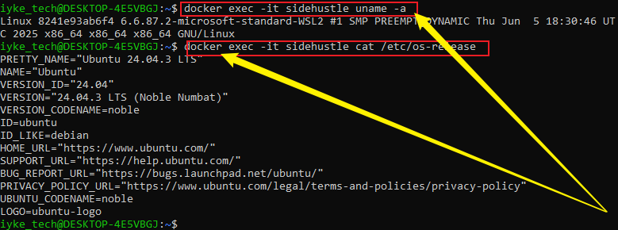

## Stop the container and verify its status

In this step, I used the docker stop command to stop the running container, effectively halting its execution. After stopping it, I ran `docker ps -a` to list all containers and verify the container’s status, confirming that it had successfully stopped and was no longer running.

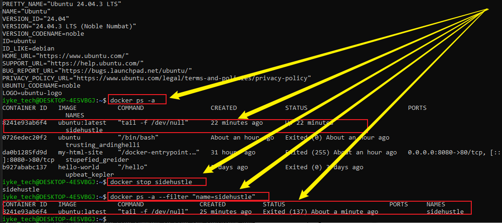

## Restart the container and verify it’s running

In this step, I restarted the container by running the command docker `start sidehustle`, which initiates the previously stopped container. After starting it, I verified that it was running by executing `docker ps -a --filter "name=sidehustle"`, which lists the container and shows its current status, confirming that the container had successfully resumed operation.

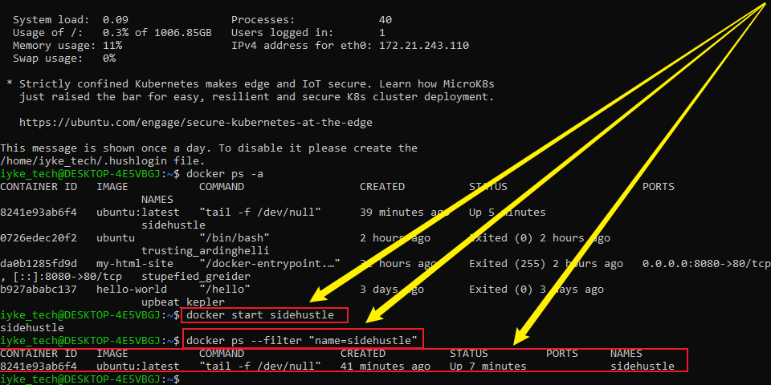

# Observe changes after restart

## Step 1: Create a file inside the container

In this step, I executed a command inside the container to write the text `hello` into a file named `/tmp/testfile`. After creating the file, I verified its contents by reading the file, confirming that the text had been successfully saved within the container’s filesystem.

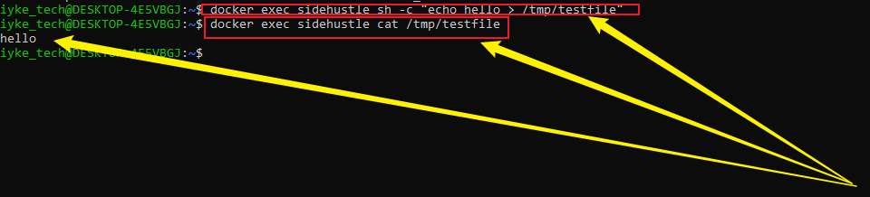

## Step 2: Restart the container
```
In this step, I restarted the container to test the persistence of data within it. The restart process stops the container and then immediately starts it again, allowing me to observe whether files or changes made before the restart remain intact in the container’s filesystem.
```
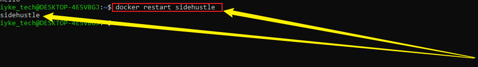

## Step 3: Check the file after restart

Verify that the file is still there:

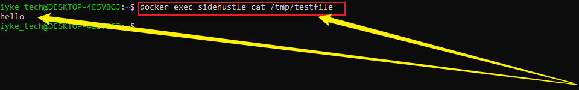
```
This demonstrates that the container’s filesystem retains all changes and data across stopping and starting the container. As a result, any files or modifications made before the restart, such as /tmp/testfile, remain intact and accessible after the container is restarted.
```
## Remove container to see data loss

First, if the container is still running, stop it using the `docker stop` command to ensure it is not active. Once the container has stopped, you can safely remove it from your system using the `docker rm` command, which deletes the container and frees up associated resources.

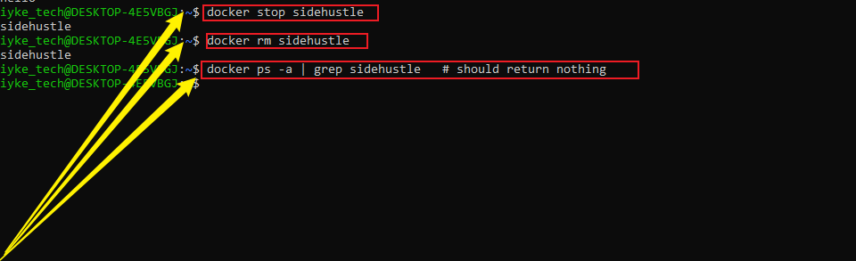

## Summary 
This project guides you through the core operations of Docker containers using an official Ubuntu image. You start by launching a container and running simple commands inside it to interact with the environment. Next, you practice stopping the container and verifying its status, then restarting it to observe how the container’s filesystem persists across stop/start operations. Finally, you learn how to safely remove the container and confirm that it has been deleted from your system. These exercises provide hands-on experience in managing container lifecycles and understanding Docker’s fundamental workflow.